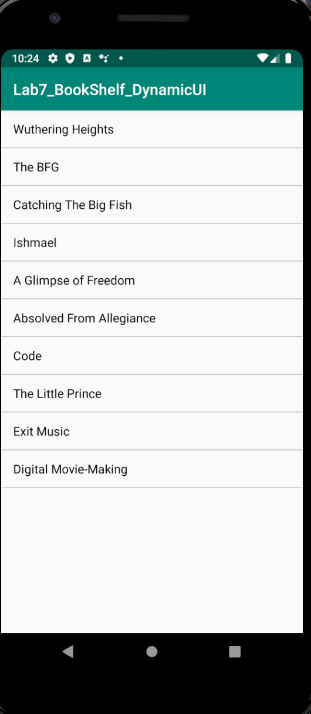
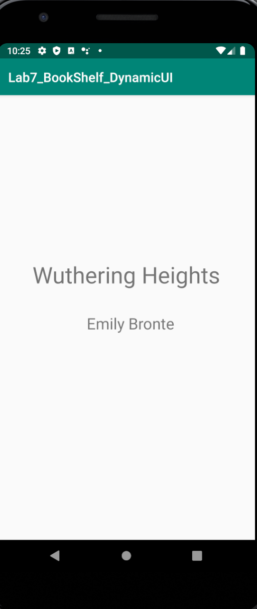
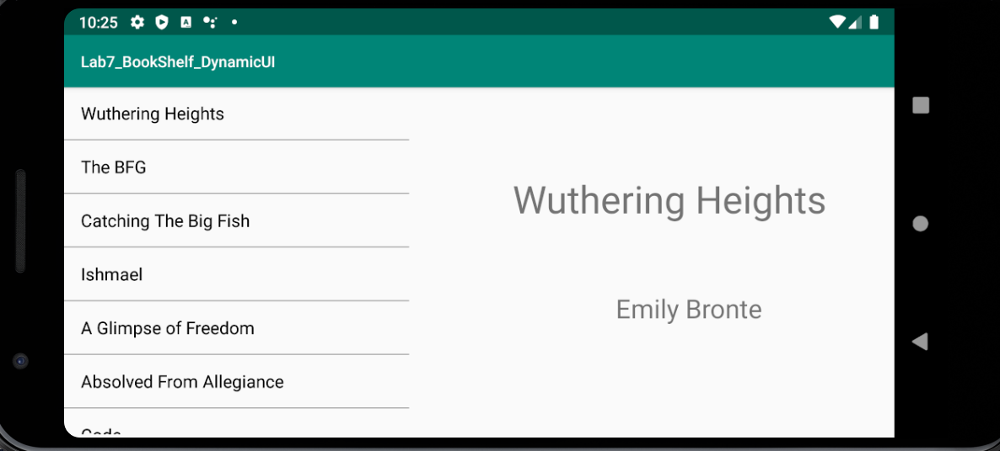

# CIS3315_Lab7_BookShelf

This app displays a list of books and a page displaying a book's details when selected. The screen will either show just the 
list of books, just the book's details, or both, depending on the orientation and size of the screen.

*This app was made to practice the use of fragments as well as to create adaptive layouts.*

